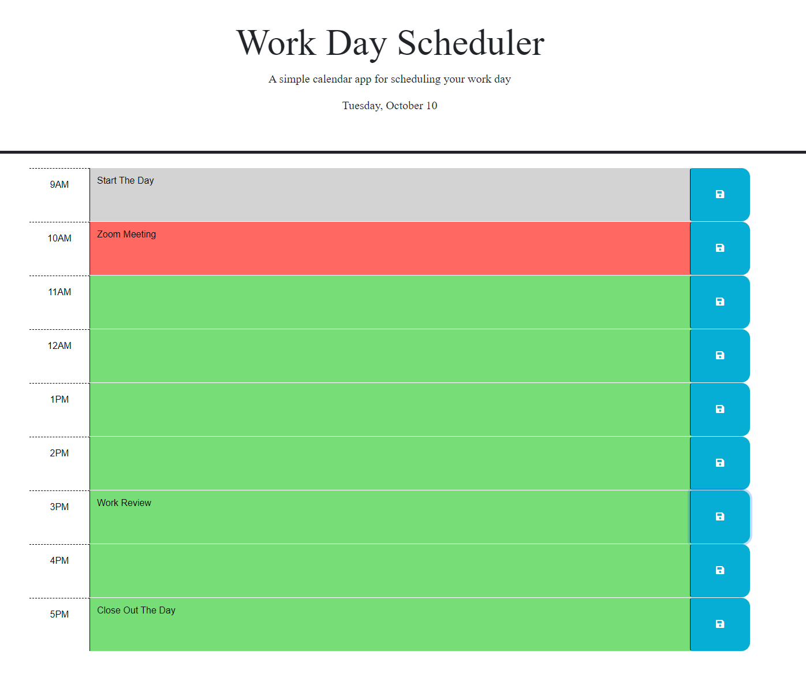

# Daily Schedule

 An hourly event planner for the day.
 
## Description

 A simple application that will load up a daily list of tasks. Any hour block can be changed and saved to local storage to load up next time. If it is currently past the time it will be grayed out, if it is in the same hour it will be highlighted in red, and future blocks are green. Two Const variables at the start of the script.js will allow you to set the time to start anywhere from Midnight to 11pm (0-23) and how many hours you want to track. If you try to go past 11pm in any way it simply will not populate.

### Preview Page

Page Link:[https://kylatae.github.io/event_schedule/](https://kylatae.github.io/event_schedule/) 

Repo Link:[https://www.github.com/kylatae/event_schedule/](https://www.github.com/kylatae/event_schedule/)

## Authors & Contributors 

Arthur Henningfield

## License

See repo

